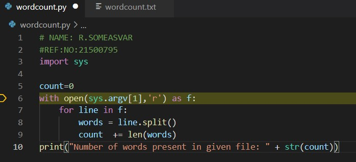

# command-line-arguments-to-count-word
## AIM:
To write a python program for getting the word count from the contents of a file using command line arguments.
## EQUIPEMENT'S REQUIRED: 
PC
Anaconda - Python 3.7
## ALGORITHM: 
### Step 1:
Open two extension .py and .txt extensions.
### Step 2: 
 Enter the code by importing sys.
### Step 3: 
Save the two extension files.
### Step 4:  
Open terminal to run the program.
### Step 5: 
Activate Conda.
### Step 6: 
Run by entering file names after word python.
## PROGRAM:
~~~
### NAME: R.SOMEASVAR
### REF:NO: 21500795
import sys
count=0 
with open(sys.argv[1],'r')  as f:
    for line in f:    
        words = line.split()
        count  += len(words) 
    print("Number of words present in given file: " + str(count))
~~~

### OUTPUT:
PROGRAM:

TERMINAL:

## RESULT:
Thus the program is written to find the word count from the contents of a file using command line arguments.
